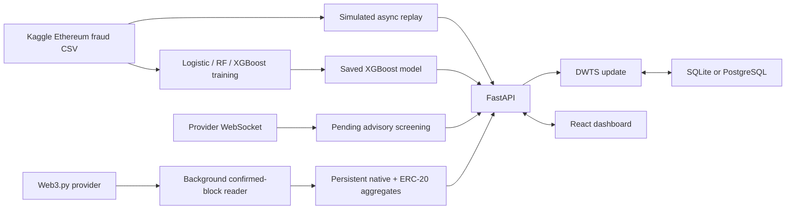

# AI-Powered Fraud Detection with Dynamic Wallet Trust Scoring

This college prototype classifies historical Ethereum wallet activity with XGBoost and
turns each prediction into a stateful Dynamic Wallet Trust Score (DWTS). A FastAPI
backend can replay the Kaggle data, screen proposed transactions, subscribe to
provider-visible pending transactions, or poll confirmed Ethereum blocks through Web3.py,
while the React **DWTS decision console** shows risk probability, quality-gated
model evidence, wallet history, contract-call context, and the resulting action.

For a non-technical walkthrough, provider setup, and demonstration script, start with
[quickstart.md](quickstart.md).

> Scope: pending mode only sees transactions exposed by the configured provider's
> mempool. The confirmed mode remains the authoritative state-changing path.

## Architecture



See [docs/architecture.md](docs/architecture.md) for the score formula and thresholds.

## Prerequisites

- Python 3.10 or newer
- Node.js 20.19 or newer and npm
- Windows, macOS, or Linux
- About 1 GB free space for Python and frontend packages

## Setup (under 10 minutes on a typical connection)

1. Clone and enter the repository.

   ```powershell
   git clone https://github.com/Arjun220905/ai-powered-fraud-detection-layer-dwts.git
   cd ai-powered-fraud-detection-layer-dwts
   ```

2. Confirm `data/transaction_dataset.csv` exists. If it does not, download the public
   Kaggle Ethereum Fraud Detection Dataset and follow [data/README.md](data/README.md).

3. Create and activate a virtual environment.

   Windows PowerShell:

   ```powershell
   python -m venv .venv
   .\.venv\Scripts\Activate.ps1
   ```

   macOS/Linux:

   ```bash
   python3 -m venv .venv
   source .venv/bin/activate
   ```

4. Install, train, and start from the project root. Use `Copy-Item .env.example .env`
   on Windows or `cp .env.example .env` on macOS/Linux.

   ```text
   python -m pip install -r backend/requirements.txt
   python backend/app/ml/train_model.py
   npm --prefix frontend ci
   python dev.py
   ```

   The same terminal now runs the API at `http://localhost:8000` and dashboard at
   `http://localhost:5173`. Press `Ctrl+C` to stop both.

Configuration is read from environment variables. The launcher works without `.env`;
copy `.env.example` to `.env` only when you need custom paths, providers, or limits.
Never commit the `.env` file.

### PostgreSQL and multiple backend instances

SQLite remains the zero-setup default. For a shared production database, set a strong
`POSTGRES_PASSWORD`, uncomment `DATABASE_URL` in `.env`, and run:

```powershell
docker compose up -d postgres
python dev.py
```

The same SQLAlchemy store supports both databases. A database lease elects exactly one
Ethereum-ingestion worker while other API instances serve the shared cached results.
Rate limits, audit records, reviewed labels, block state, and wallet scores are shared.

Set `VIEWER_API_KEY`, `REVIEWER_API_KEY`, and `ADMIN_API_KEY` for role-separated
access through the `X-API-Key` header. `API_KEY` remains an admin-compatible fallback.
The dashboard keeps a key only in browser session storage and uses it for screening,
review, audit, and operational requests; it is never compiled into the frontend bundle.
Set both `SSL_CERTFILE` and `SSL_KEYFILE` to
make the local Uvicorn server use HTTPS; a reverse proxy remains recommended when
deployed publicly.

Set `ALERT_WEBHOOK_URL` to receive deduplicated ingestion-error and feature-drift JSON
alerts. Create a consistent SQLite backup—or call `pg_dump` without exposing the
database password in the process arguments—using:

```powershell
python backend/backup_database.py
```

## Tests

Train the model first, then run:

```powershell
cd backend
python -m pytest -q
python benchmark.py --requests 100
cd ../frontend
npm test
npm run build
npx playwright install chromium
npm run test:e2e
```

## Model performance

`train_model.py` uses a reproducible wallet-group-aware stratified 80/20 split
(`random_state=42`), applies sigmoid probability calibration on a separate grouped
partition, and saves
the final XGBoost pipeline to
`backend/app/ml/model.pkl`, and writes the exact report to
`backend/app/ml/metrics.json`. The measured values below come from the included dataset
(9,841 rows; 1,968 held-out test rows). No wallet address appears in both partitions.

| Model | Accuracy | Precision | Recall | F1 | ROC-AUC |
|---|---:|---:|---:|---:|---:|
| Logistic Regression | 0.6159 | 0.3513 | 0.8670 | 0.5000 | 0.8612 |
| Random Forest | 0.9792 | 0.9829 | 0.9220 | 0.9515 | 0.9984 |
| XGBoost, tuned + calibrated (selected) | 0.9842 | 0.9698 | 0.9587 | 0.9642 | 0.9988 |

No metric is fabricated. Re-running training updates `metrics.json`; small platform
differences may occur despite the fixed seed.

The selected model also measured PR-AUC `0.9961`, Brier score `0.0120`, and false
positive rate `0.0085` (0.85%). Grouped three-fold cross-validation and the reproducible
six-candidate grouped XGBoost search are saved in `metrics.json`. The latest
checked local benchmark completed 100 sequential API requests at 42.24
requests/second with 24.831 ms p99 latency; its reproducible output is stored in
`backend/benchmark_results.json`.

## Simulated, pending, and confirmed streams

`GET /api/stream/next` advances one CSV row, runs real model inference, and persists an
incremental score update in SQLite. After the last row, replay wraps to the beginning.
`POST /api/stream/reset` resets only the replay cursor; wallet history remains stateful.

Set `WEB3_PROVIDER_URL` in `.env` to an Infura/Alchemy HTTPS endpoint, then choose
**Confirmed chain** in the dashboard. A background task ingests confirmed blocks,
backfills a configurable startup window, decodes native ETH and ERC-20 transfers, and
persists block events and wallet scores in SQLite. It resumes from the saved cursor
after restart and rolls back orphaned data when the stored chain tip changes. Catch-up
RPC calls run concurrently up to `LIVE_CATCHUP_CONCURRENCY`, while database commits
remain in canonical block order. `LIVE_MAX_CATCHUP_BLOCKS` bounds each recovery cycle;
larger gaps continue in later cycles instead of permanently failing startup.

Live feature recovery runs in the background, so a large chain history cannot block the
independent dataset replay or FastAPI startup. The zero-setup SQLite configuration keeps
256 recent blocks; increase `LIVE_RETENTION_BLOCKS` only after measuring storage needs.

`GET /api/blockchain/live-stream?limit=25` reads the latest persisted result; it does
not trigger provider work. A block/address key prevents duplicate DWTS updates. New
wallets remain in **Observe** until `LIVE_MIN_WALLET_EVENTS` is reached because sparse
live features do not match the model's historical training distribution.

For Alchemy, the matching WebSocket endpoint is derived automatically from
`WEB3_PROVIDER_URL`; other providers should set `WEB3_WS_PROVIDER_URL` explicitly to
enable **Pending** mode. Use comma-separated `WEB3_WS_PROVIDER_URLS` for automatic
WebSocket failover. Pending assessments are persisted as advisory results,
track pending/confirmed/replaced/dropped status, and are reconciled by transaction
hash when a confirmed block arrives. They never update DWTS before confirmation.
Terminal pending records older than `PENDING_RETENTION_SECONDS` are deleted, and
`PENDING_MAX_RECORDS` applies an additional storage cap so the table does not grow
without bound.
`POST /api/screen-transaction` provides a pre-broadcast decision for an application
that controls whether a proposed transaction is submitted. Its model scope is explicitly
reported as `wallet_behavior_preview`: the available dataset cannot support an honest
transaction-trained classifier.

## Fraud intelligence workspace

The dashboard includes trend analytics, explainable model evidence, high-risk wallet
clusters, alert review, wallet behavior profiles, paged investigation replay, model
monitoring, and a read-only What-if Risk Simulator. The interface supports persistent
light and dark themes and responsive layouts down to 320px.

The wallet graph works for every evidence source. Dataset replay, pending, and API
sources show their observed wallets as searchable, risk-colored nodes. **Retained
confirmed chain** additionally draws real sender-to-recipient arrows from persisted
transactions; relationships are never invented for sources that do not contain them.
Use **Search graph** after entering a full or partial address, filter by risk, then use
pagination, zoom, pan, or select a node to open its investigation.

The What-if Risk Simulator keeps the raw wallet-model probability visible and adds a
documented, bounded scenario adjustment for changed ETH amount or recipient. It does
not broadcast a transaction or save a score. See [docs/intelligence.md](docs/intelligence.md)
and [docs/ui-testing.md](docs/ui-testing.md) for evidence scope and verification.

## What happens, in plain language

The system screens proposed/provider-visible pending activity and watches confirmed
Ethereum activity while building a running behavior history
for each wallet. The model estimates how similar that behavior is to fraud examples in
the training data. DWTS smooths repeated estimates into a 0–100 trust score, and the
dashboard translates that score into Observe, Approve, Delay, Verify, or Block.

No money is moved and no blockchain transaction is stopped: these actions are review
recommendations for the prototype.

## Technical flow

1. The optional WebSocket worker records provider-visible pending transactions.
2. The confirmed-block poller reads blocks that have the configured confirmation depth.
3. Native transactions and ERC-20 `Transfer` logs are normalized and stored in the
   configured SQLite/PostgreSQL database.
4. Persisted events rebuild incremental wallet features after restart.
5. The tuned and calibrated XGBoost pipeline returns fraud probability and TreeSHAP
   feature contributions.
6. A separate Isolation Forest candidate is evaluated without changing the supervised
   fraud probability or DWTS policy. It is served only if held-out ROC-AUC reaches 0.60;
   the current dataset's candidate is rejected and reported honestly in `metrics.json`.
7. Known ERC-20 transfer/approval and common swap selectors are decoded locally; unknown
   selectors remain visible without an unsafe guessed ABI.
8. The cold-start gate either keeps the wallet in Observe or applies the DWTS update.
9. Idempotency keys prevent duplicate scores; reorg detection removes orphaned blocks,
   events, and score changes.
10. FastAPI serves cached results to React without causing extra provider calls.
11. Provider failover, shared rate limiting, audit logging, retention, readiness checks,
   drift warnings, and a single ingestion leader protect the operational path.

The dashboard's decision trace intentionally represents the latest incoming wallets; it
is not presented as one wallet's time series. Exact wallet history is shown separately in
the investigation workspace. The pre-broadcast form supports recipient, ETH value, gas,
gas price, nonce, and contract calldata already accepted by the backend.

## Reviewed live labels and retraining

Authorized reviewers can submit a binary outcome to `POST /api/labels`. The API stores
the reviewer, notes, transaction/address identity, and the wallet-feature snapshot used
at review time. `GET /api/labels` exports these records.

To include reviewed feature snapshots in a later training run:

```powershell
Invoke-RestMethod http://localhost:8000/api/labels `
  -Headers @{"X-API-Key"=$env:API_KEY} |
  ConvertTo-Json -Depth 8 |
  Set-Content reviewed_labels.json

python backend/app/ml/train_model.py data/transaction_dataset.csv reviewed_labels.json
```

No reviewed label is generated automatically; human confirmation is required.
At least 50 reviewed rows, 10 examples from each class, and five unique wallets in each
class are required before the trainer uses a wallet-group-separated 80% live-training
split and reports a separate untouched 20% live validation result. Smaller collections
are retained but never mixed into evaluation.
Model promotion also enforces minimum ROC-AUC/F1 and maximum false-positive-rate gates.

## Operational endpoints

- `GET /health`: process, model, and database backend
- `GET /ready`: model/database/provider readiness
- `GET /api/blockchain/status`: provider failover and ingestion leadership
- `GET /api/blockchain/pending-stream`: pending lifecycle and advisory decisions
- `POST /api/screen-transaction`: pre-broadcast transaction screening
- `GET /api/intelligence/overview`: bounded trends, graph, clusters, anomalies, and monitoring
- `GET /api/intelligence/wallet/{address}`: behavior profile and investigation timeline
- `GET /api/intelligence/wallet/{address}/history`: stable paged evidence history
- `POST /api/intelligence/simulate`: read-only baseline/scenario risk comparison
- `GET /api/intelligence/alerts`: persistent high-risk dashboard alerts
- `GET /api/operations/metrics`: counts, block lag, provider state, and drift warnings
- `GET /api/operations/audit`: recent API audit records
- `POST/GET /api/labels`: reviewed live outcomes and feature snapshots
- `GET /api/wallets`: wallet investigation search; exact history is at
  `GET /api/wallets/{address}` and can be exported from the dashboard
- `GET /metrics`: Prometheus-format operational metrics

## Project layout

```text
backend/app/ml/           feature preparation, training, saved model and metrics
backend/app/trust_score/  DWTS plus SQLite/PostgreSQL persistence and operations
backend/app/stream/       row-by-row historical replay
backend/app/blockchain/   confirmed-block reader and live feature aggregation
backend/app/intelligence.py bounded analytics, graph, alerts and investigation evidence
backend/tests/            score and API smoke tests
frontend/src/             React dashboard, graph, simulator and theme system
frontend/tests/           Playwright responsive and interaction regressions
data/                     Kaggle CSV and provenance notes
docs/                     architecture details
```

## Irreducible limitations

- The dataset is historical, static, wallet-level aggregate data—not raw transactions.
- The supplied dataset has no trustworthy event timestamps or entity-group identifiers,
  so time-based/entity-grouped validation cannot be claimed until such data is collected.
- Transaction-level modelling, named fraud categories, verified external address
  intelligence, and external-dataset validation require real labelled sources not present
  in this repository; none are synthesized or silently substituted.
- DWTS uses a starting score of 70 and update weight of 0.25. Under the documented
  five-point convergence definition it reaches repeated safe/fraud steady state in
  7/10 observations; thresholds still need calibration against real operational cost.
- The model was trained on lifetime-style historical aggregates, not cold session
  aggregates. It is calibrated and drift-monitored, but reliable live-domain retraining
  still depends on enough genuine human-reviewed outcomes.
- ERC-20 values use each token's `decimals()` response, with an explicit 18-decimal
  fallback for non-standard tokens; token-contract aggregates are observed, while
  protocol-specific intent still requires custom ABI decoding.
- PostgreSQL, TLS certificate issuance, provider accounts, alert receivers, and human
  reviewers are external services. The repository includes their integrations, Docker
  configuration, health checks, metrics, backups, and CI, but cannot host those services.
- Pending coverage is provider-specific and cannot see a global Ethereum mempool or
  block transactions submitted outside a system that uses the screening API.

## Credits and references

- [Public Kaggle Ethereum Fraud Detection Dataset](https://www.kaggle.com/datasets/vagifa/ethereum-frauddetection-dataset), published by Vagif Aliyev under Kaggle's displayed Database/Database Contents terms
- Chen & Guestrin, *XGBoost: A Scalable Tree Boosting System* (2016)
- *Near Real-Time Ethereum Fraud Detection Using Explainable AI in Blockchain
  Networks*, Applied Sciences 15(19), 2025, DOI `10.3390/app151910841`
- FastAPI, scikit-learn, XGBoost, React, Vite, Tailwind CSS, and Recharts documentation
