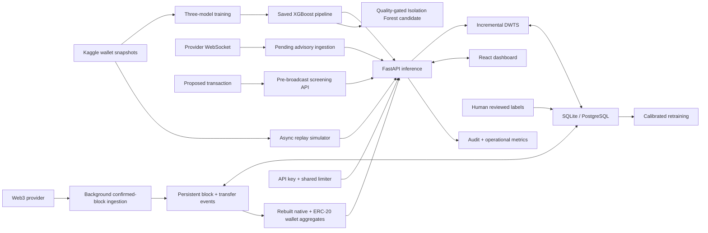

# Architecture

DWTS uses an exponentially weighted update: `new = 0.75 × old + 0.25 ×
(100 × (1 − fraud probability))`. This makes repeated risky observations lower a
wallet's score and repeated safe observations restore it gradually.

Risk policy: 75–100 Approve, 55–74.99 Delay, 30–54.99 Verify, and below 30 Block.

Live mode resumes from a SQLite chain cursor, backfills missed confirmed blocks, decodes
native ETH and ERC-20 transfers, and maps the rebuilt wallet aggregates into the same
XGBoost pipeline used by replay. A stored block hash detects short chain reorganizations;
orphaned events and their DWTS changes are removed before ingestion resumes.
Missed blocks are fetched concurrently in bounded batches, then validated and committed
in canonical order so catch-up is faster without weakening reorganization checks.

Pending mode stores provider-visible assessments without changing DWTS. Transaction
hashes are reconciled when confirmed; same-sender/same-nonce replacements and expired
records are tracked. Coverage is limited to the configured provider's mempool. The
screening endpoint provides a pre-broadcast decision only to applications that control
transaction submission.
Terminal pending records are deleted after the configured retention period.

Wallets with fewer than the configured minimum observations remain in `Observe` and do
not change DWTS. This protects against the known mismatch between sparse live history
and the lifetime-style aggregates used during model training.
Reviewed live outcomes require a minimum class-balanced sample before they are split
into separate training and untouched live-validation partitions. Promotion rejects
artifacts that fail the documented quality gates.
Historical training, tuning, calibration, cross-validation, and testing use wallet-group
stratification, so repeated snapshots from one address never cross partitions.

All API instances share a database lease; only the current lease owner polls Ethereum.
Provider URLs are attempted in order with automatic failover. The database also owns
the rate-limit buckets, retention cursor, audit log, reviewed labels, and cached result,
so horizontal API instances do not duplicate work.
The dashboard stores a supplied role key only for the browser session and exposes
screening, explanations, human review, provider lag, audit activity, lifecycle counts,
wallet search/history export, anomaly evidence, and common contract-call context.
